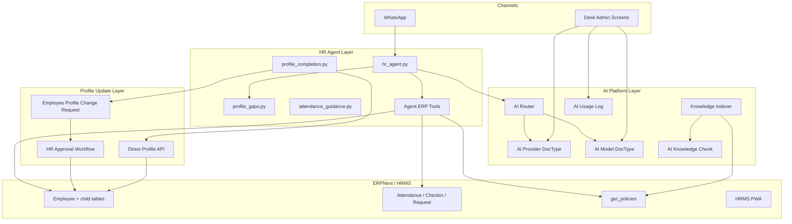
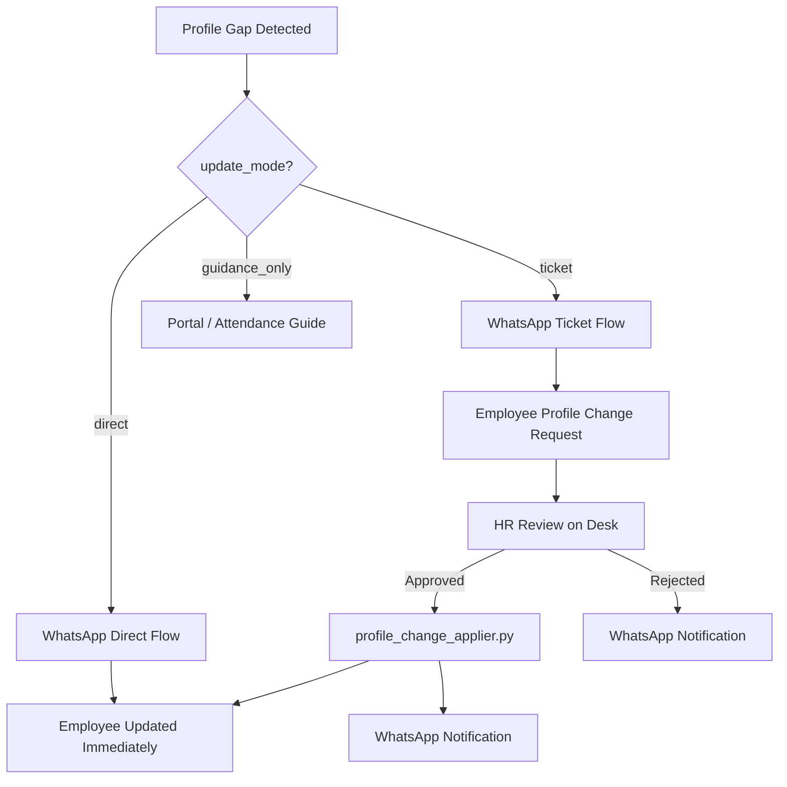
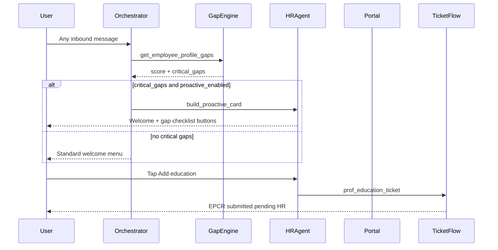
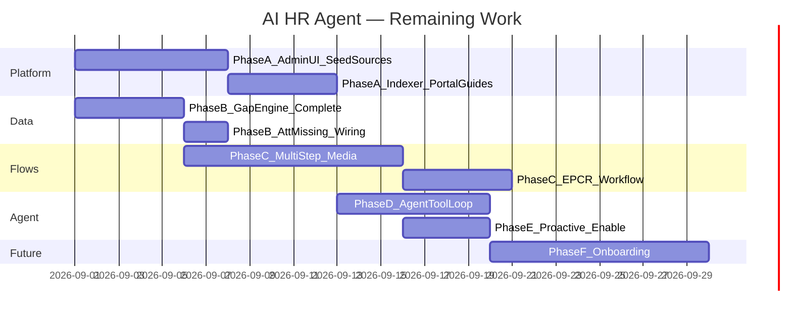

# AI-Enabled HR Agent — Comprehensive Master Plan

**Saved:** 2026-08-30 | **Updated:** 2026-08-31 (implementation status refresh)  
**App:** `ai_workplace` | **Site:** `erp.v15`  
**Supersedes/extends:** [`docs/WHATSAPP_MENU_IMPLEMENTATION_PLAN.md`](../docs/WHATSAPP_MENU_IMPLEMENTATION_PLAN.md)

---

## Implementation Status (2026-08-31)

| Phase | Status | Summary |
|-------|--------|---------|
| **0 — Support PIN Security** | ✅ **Done** | Full PIN verify flow, secure session, redaction, orchestrator middleware |
| **0b — Menu-driven security** | ✅ **Done** | `WhatsApp Menu Item.security_level` is authoritative; Desk-configurable per menu |
| **A — AI Platform** | 🟡 **Partial** | DocTypes + router + keyword indexer exist; admin UI is link skeleton only |
| **B — Profile Gap Engine** | 🟡 **Partial** | Core API exists; missing compliance/contract/attendance gaps + att_missing wiring |
| **C — Profile Completion** | 🟡 **Partial** | EPCR + hub + basic flows wired; missing multi-step/media/workflow/notifications |
| **D — HR Agent** | 🟡 **Partial** | `pol_ai_assistant` live with keyword tool injection; not full agent loop |
| **E — Proactive Nudges** | 🟡 **Partial** | Code wired but **disabled by default**; settings fields incomplete |
| **F — Onboarding** | 🔴 **Pending** | DocType schema only; no playbook-driven conversation |

**What works end-to-end today:**
- WhatsApp menus + 28+ self-service handlers
- Support PIN verification before secure menu items (configured per `WhatsApp Menu Item`)
- `update_profile` → Profile Completion Hub (replaces "coming soon")
- `pol_ai_assistant` → AI HR Agent (reactive Q&A via router + keyword tools)
- Proactive nudge code path exists (enable via `AI Workplace Settings.proactive_notifications_enabled`)

---

## Phase 0 — Support PIN Security (✅ COMPLETED)

**Authoritative spec:** [`Cursor_Plan_MicroMerger_WhatsApp_Support_PIN_Final.md`](Cursor_Plan_MicroMerger_WhatsApp_Support_PIN_Final.md)  
**HRMIS API contract:** [`HRMIS_SUPPORT_PIN_API.md`](HRMIS_SUPPORT_PIN_API.md)

| Component | Path | Status |
|-----------|------|--------|
| Security Profile DocType | `doctype/whatsapp_security_profile/` | ✅ Done |
| Service Security Policy | `doctype/whatsapp_service_security_policy/` | ✅ Done (fallback for non-menu keys) |
| PIN core module | `security/support_pin.py`, `authorization.py`, `secure_session.py` | ✅ Done |
| **Menu-driven security** | `WhatsApp Menu Item.security_level` + `security/menu_security.py` | ✅ Done |
| Portal APIs | `api/support_pin.py` | ✅ Done |
| WhatsApp middleware | `security/pin_flow.py` + orchestrator `WAITING_FOR_SUPPORT_PIN` | ✅ Done |
| Credential redaction | `security/credential_redaction.py` + webhook + HR inbox | ✅ Done |
| Tests | `tests/test_support_pin.py` (15 tests) | ✅ Done |
| HRMIS PIN UI | User Profile (HRMIS team) | Out of scope — API contract provided |

**Rules:** PIN set/change only in HRMIS Portal; WhatsApp verify-only; 24h secure session; PIN change invalidates sessions; do not reuse `Employee.passcode`.

**Menu security (Phase 0b):** Each `WhatsApp Menu Item` has a **Security Level** field:
- `None` — no PIN required
- `PIN Required` — Support PIN verification before service runs
- `PIN + Approval` — PIN + HR approval (for sensitive profile changes)

Authorization lookup order: **WhatsApp Menu Item** → Service Security Policy DocType → internal fallback defaults (`prof_*`, navigation keys).

Re-seed defaults: `bench --site erp.v15 execute ai_workplace.ai_workplace.doctype.whatsapp_menu_item.whatsapp_menu_item.setup_default_menu_items --kwargs '{"force": True}'`

---

## 1. What is already completed (baseline)

### Foundation (✅ Done)
| Area | Status | Key files |
|------|--------|-----------|
| WhatsApp webhook + identity | ✅ Done | [`api/whatsapp_webhook.py`](../ai_workplace/api/whatsapp_webhook.py), [`identity/resolver.py`](../ai_workplace/identity/resolver.py) |
| Persona menus + auth gateway | ✅ Done | [`context/resolver.py`](../ai_workplace/context/resolver.py), [`auth/gateway.py`](../ai_workplace/auth/gateway.py), [`menu/seed_data.py`](../ai_workplace/menu/seed_data.py) |
| Conversation orchestrator | ✅ Done | [`conversation/orchestrator.py`](../ai_workplace/conversation/orchestrator.py) |
| HR live chat + Desk inbox | ✅ Done | [`services/hr_chat.py`](../ai_workplace/services/hr_chat.py), [`page/whatsapp_hr_inbox/`](../ai_workplace/ai_workplace/page/whatsapp_hr_inbox/) |
| Audit logging | ✅ Done | `AI Action Log`, `AI Security Event`, `WhatsApp Message Log` |
| Support PIN + menu security | ✅ Done | [`security/`](../ai_workplace/security/), [`security/menu_security.py`](../ai_workplace/security/menu_security.py) |

### Self-service menus (✅ Done — 28+ leaf services)
| Domain | Examples |
|--------|------------|
| HR profile (read) | `my_profile`, `supervisor_reporting` |
| Attendance & leave | `att_today`, `att_monthly`, `att_missing` (read-only), `leave_apply` (submit) |
| Payroll docs | Salary slips, tax certificate PDF, experience/bank letters |
| Travel | All `trv_*` handlers in [`services/travel.py`](../ai_workplace/services/travel.py) |
| Deliverables | `dlv_add`, `dlv_submit`, `dlv_status` in [`services/deliverables.py`](../ai_workplace/services/deliverables.py) |
| Careers | XpertJobs guide in [`services/careers_guide.py`](../ai_workplace/services/careers_guide.py) |
| Concerns | Confidential report flow |

### Scaffolded (🟡 Partial — code exists, not production-complete)
| Area | Status | Key files | Remaining |
|------|--------|-----------|-----------|
| AI Platform | 🟡 Partial | [`ai/router.py`](../ai_workplace/ai/router.py), [`ai/indexer.py`](../ai_workplace/ai/indexer.py), [`ai/tools.py`](../ai_workplace/ai/tools.py) | Admin UI tabs, test connection, seed sources, portal guides |
| Profile gaps | 🟡 Partial | [`services/profile_gaps.py`](../ai_workplace/services/profile_gaps.py) | Compliance/contract/attendance gaps; parity with `employee_profile_analysis` |
| Attendance guidance | 🟡 Partial | [`services/attendance_guidance.py`](../ai_workplace/services/attendance_guidance.py) | `build_att_missing_footer` not wired to `att_missing` handler |
| Profile completion | 🟡 Partial | [`services/profile_completion.py`](../ai_workplace/services/profile_completion.py), [`api/profile.py`](../ai_workplace/api/profile.py) | Multi-step flows, media uploads, IBAN/CNIC validation, workflow |
| EPCR tickets | 🟡 Partial | [`doctype/employee_profile_change_request/`](../ai_workplace/ai_workplace/doctype/employee_profile_change_request/) | Frappe Workflow, HR notifications, Next of Kin applier |
| HR Agent | 🟡 Partial | [`services/hr_agent.py`](../ai_workplace/services/hr_agent.py) | Full tool-calling loop, citations, confidence threshold, tests |
| Proactive nudges | 🟡 Partial | [`services/proactive.py`](../ai_workplace/services/proactive.py) | Settings fields on DocType; attendance nudge; enable flag |
| Onboarding | 🔴 Pending | [`doctype/ai_onboarding_playbook/`](../ai_workplace/ai_workplace/doctype/ai_onboarding_playbook/) | Playbook-driven conversation not built |

### Phase 1 quick wins
| Item | Status |
|------|--------|
| Tax Certificate PDF | ✅ **Done** |
| XpertJobs guide | ✅ **Done** |
| Portal profile instructions (`update_profile`) | ✅ **Done** — Profile Completion Hub wired in orchestrator |
| `att_missing` messaging polish | 🟡 **Pending** — footer helper exists but not called |

### AI / Agent wiring (orchestrator)
| Item | Status |
|------|--------|
| `update_profile` → Profile Completion Hub | ✅ Wired |
| `pol_ai_assistant` → `start_hr_agent` | ✅ Wired |
| `hr_ai_agent` intent → `handle_hr_agent_message` | ✅ Wired |
| `prof_*` flows → `handle_profile_flow_message` | ✅ Wired (basic single-step) |
| Proactive nudge after language select | ✅ Wired (disabled by default) |
| PIN gate before secure services | ✅ Wired (menu catalog driven) |

### Reusable assets elsewhere on bench
- [`mm_app/mm_hr/report/employee_profile_analysis/`](apps/mm_app/mm_app/mm_hr/report/employee_profile_analysis/employee_profile_analysis.py) — SQL gap checks (education count, doc scans, work history, CNIC, contracts)
- [`hrms/frontend`](apps/hrms/frontend) — Portal PWA: education/work history child tables, check-in, profile docs
- [`ai_analytics/new_api.py`](apps/ai_analytics/ai_analytics/new_api.py) — `AIGateway` pattern (key rotation, fallback)
- [`frappe_ai_assistant/api/ai_api.py`](apps/frappe_ai_assistant/frappe_ai_assistant/api/ai_api.py) — `call_ai_provider()` interim bridge

---

## 2. Target architecture



**Design principles**
- **Deterministic auth + data** — AI never decides permissions; [`auth/gateway.py`](apps/ai_workplace/ai_workplace/auth/gateway.py) and tool layer enforce employee scope
- **Hybrid profile completion** (confirmed) — **two paths:**
  - **Direct self-service** — employee updates allowed fields immediately (CNIC, bank, contact, first-time document uploads)
  - **HR approval tickets** — sensitive/complex changes via **Employee Profile Change Request** DocType; HR approves → merged into Employee profile
- **Workflow-first ERP writes** — direct updates and ticket merges go through validated APIs, not raw LLM JSON
- **Human escalation** — Contact HR live chat ([`hr_chat.py`](apps/ai_workplace/ai_workplace/services/hr_chat.py)) and Concerns always available

---

## 3. Phase A — AI Platform (🟡 PARTIAL)

**Goal:** Super Admin can configure providers/models, index knowledge, monitor usage — independent of WhatsApp.

**Current state:** DocTypes created, `ai/router.py` + `ai/indexer.py` + `ai/tools.py` functional at MVP level. Admin page is a link skeleton. Groq AI Settings still used as legacy fallback.

### A1. New DocTypes (module: Ai Workplace)

| DocType | Purpose | Status |
|---------|---------|--------|
| **AI Workplace Provider** | name, slug, api_base_url, encrypted api_key, priority, is_active, test_connection | 🟡 Schema done; `test_connection` not implemented |
| **AI Workplace Model** | provider link, model_slug, display_name, capabilities, cost, is_active | 🟡 Schema done |
| **AI Workplace Knowledge Source** | type, ERP link, last_indexed, version_hash | 🟡 Schema done; no seed patch |
| **AI Workplace Knowledge Chunk** | parent source, chunk_text, embedding_json | 🟡 Schema done; keyword MVP only |
| **AI Workplace Usage Log** | model, provider, channel, tokens, latency, success | 🟡 Schema done; router logs basic entries |

Extend existing **Groq AI Settings** → migrate into Provider/Model records OR keep as legacy fallback with deprecation note.

### A2. Desk admin page — `AI Workplace Admin`

New page at [`ai_workplace/page/ai_workplace_admin/`](../ai_workplace/ai_workplace/page/ai_workplace_admin/) with tabs:

| Tab | Features | Status |
|-----|----------|--------|
| **Providers** | CRUD, test connection, priority drag-order | 🔴 Link list only |
| **Models** | Enable/disable, capability tags, default model per use-case | 🔴 Link list only |
| **Knowledge** | Source list, Re-index button, index status, chunk count | 🔴 Not built |
| **Usage** | Filter by date/employee/channel, token/cost charts | 🔴 Not built |
| **Agent Settings** | System prompts, proactive nudge toggles, confidence threshold | 🔴 Not built |

Role: `HR Workplace Agent` (exists) + `System Manager` for provider keys.

### A3. AI Router — [`ai_workplace/ai/router.py`](../ai_workplace/ai/router.py)

**Status:** 🟡 MVP working — provider priority, OpenAI-compatible calls, Groq fallback, usage logging.

**Remaining:**
- `test_connection` on Provider DocType
- Accurate token counts (currently word-split approximation)
- Cost estimate per call
- Circuit breaker inspired by [`AIGateway`](../../ai_analytics/ai_analytics/new_api.py)

```
complete(prompt, system, capabilities=[TEXT], response_format=None)
  → load active providers by priority
  → pick first active model matching capabilities
  → call provider adapter (Groq/OpenAI/Anthropic/OpenRouter presets)
  → on rate-limit/5xx → fallback next model
  → log AI Workplace Usage Log
  → never expose API keys to client
```

Interim: wrap [`frappe_ai_assistant.call_ai_provider`](apps/frappe_ai_assistant/frappe_ai_assistant/api/ai_api.py) until adapters are complete.

Inspired by [`AIGateway`](apps/ai_analytics/ai_analytics/new_api.py) circuit-breaker + key health.

### A3b. AI Embeddings (MVP)

- Start with **keyword + subject match** on policy titles (`get_policies`)
- Phase A.5: embedding via active EMBED-capable model; store in `AI Knowledge Chunk`
- Retrieval: top-k chunks + policy metadata injected into agent context

### A4. Knowledge Indexer — [`ai_workplace/ai/indexer.py`](../ai_workplace/ai/indexer.py)

**Status:** 🟡 Keyword MVP — `reindex_source`, `search_knowledge`, Policy + MenuCatalog extractors, daily scheduler in `hooks.py`.

| Source type | Origin | Status |
|-------------|--------|--------|
| Policy | `hrms.api.employee.get_policies` | ✅ Extractor done |
| MenuCatalog | [`menu/seed_data.py`](../ai_workplace/menu/seed_data.py) | ✅ Extractor done |
| SOP / Travel | `System Notifications`, travel SOP PDFs | 🔴 Not indexed |
| PortalHelp | Static markdown in repo (`docs/portal_guides/`) | 🔴 Directory not created |
| ProfileGuide | Gap checklist templates | 🔴 Not indexed |
| Onboarding | Playbook DocType | 🔴 Not indexed |

**Remaining:** Seed default Knowledge Sources on install; policy doc save hook; `docs/portal_guides/` content; embedding prep (`embedding_json` field).

Scheduler: `reindex_stale_sources()` daily + on policy doc save hook.

---

## 4. Phase B — Profile Gap Engine (🟡 PARTIAL)

**Goal:** Single API that returns structured gaps for an employee — reused by agent, proactive nudges, and Desk reports.

**Current state:** [`services/profile_gaps.py`](../ai_workplace/services/profile_gaps.py) returns identity/contact/bank/education/work gaps + PIN gap + pending EPCRs. [`services/attendance_guidance.py`](../ai_workplace/services/attendance_guidance.py) has snapshot API but footer not wired.

### B1. New service — [`services/profile_gaps.py`](../ai_workplace/services/profile_gaps.py)

Centralize logic currently scattered in [`employee_profile_analysis.py`](../../mm_app/mm_app/mm_hr/report/employee_profile_analysis/employee_profile_analysis.py):

**Implemented gap checks:** profile image, CNIC + scans, contact, bank, education count/docs, work history count, support PIN, pending EPCRs.

**Remaining gap checks:** compliance docs (police cert, PSEA, Declaration of Conflict), contract status, attendance gaps (today not checked in, missing days last 30d), cached Employee custom fields (`custom_profile_completeness_score`).

```python
get_employee_profile_gaps(employee_id) -> ProfileGapReport
```

**Gap categories** (each item: `key`, `label`, `severity`, `update_mode`, `status`, `action_hint`):

| Category | Checks | Update mode |
|----------|--------|-------------|
| **Identity** | `profile_image`, `cnic`, `cnic_scan_front/back`, `date_of_issue`, `valid_upto` | **Direct** (first add / upload) |
| **Contact** | `cell_number`, `prefered_email`, `emergency_phone_number`, next of kin | **Direct** for phone/email; **Ticket** for next of kin rows |
| **Bank** | `bank_name`, `bank_ac_no`, `iban`, `bank_account_title` | **Direct** (employee can add/update directly) |
| **Education** | row count; rows missing `upload_scan_copy` | **Ticket** — new row + doc via Profile Change Request |
| **Work history** | row count; rows missing `upload_scan_copy` | **Ticket** — new row + doc via Profile Change Request |
| **Compliance** | Declaration of Conflict; `police_character_certificate`; PSEA cert | **Direct** upload if missing; **Ticket** if re-verification needed |
| **Contract** | latest `Employee Contract` generated/signed | HR only — not self-service |
| **Attendance** | today not checked in; missing days last 30d | **Guidance only** → Portal check-in / supervisor |

`update_mode` values: `direct`, `ticket`, `portal_only`, `guidance_only`

**Output shape:**
```json
{
  "completeness_score": 72,
  "critical_gaps": [...],
  "recommended_next_action": "submit_education_ticket",
  "direct_flows_available": ["cnic_upload", "bank_update", "contact_update"],
  "ticket_flows_available": ["education_add", "work_history_add"],
  "pending_tickets": [{"name": "EPCR-00001", "type": "Education", "status": "Pending HR Review"}]
}
```

Add optional cached fields on Employee (custom, mm_app):
- `custom_profile_completeness_score` (Int)
- `custom_profile_last_gap_check` (Datetime)
- Updated after each gap scan / profile save

### B2. Attendance gap module — [`services/attendance_guidance.py`](../ai_workplace/services/attendance_guidance.py)

**Status:** 🟡 `get_attendance_snapshot` done; `build_att_missing_footer` exists but **not called** from `attendance_leave.py`.

**Remaining:** Wire footer into `att_missing` handler; mobile check-in deep links; supervisor regularization template.

---

## 5. Phase C — Profile Completion: Direct Updates + HR Approval Tickets (🟡 PARTIAL)

**Goal:** Employees complete their profile via WhatsApp using two controlled paths — immediate writes for safe fields, HR-approved tickets for everything else.

**Current state:** EPCR DocType + Profile Change Item child table exist. [`services/profile_completion.py`](../ai_workplace/services/profile_completion.py) provides Profile Completion Hub, basic single-step CNIC/bank direct flows, education/work ticket flows, and `prof_my_requests`. [`api/profile.py`](../ai_workplace/api/profile.py) has 3 whitelisted methods. [`profile_change_applier.py`](../ai_workplace/services/profile_change_applier.py) merges Education/Work History on approve.

**Remaining:** Multi-step flows with WhatsApp media (CNIC scans, photo, compliance docs); IBAN/CNIC validation; Frappe Workflow for EPCR; WhatsApp notifications on approve/reject; Next of Kin applier; hub button routing fixes (`svc_prof_{gap_key}` → flow keys).

### C0. Field classification (product rule)

Configured in new **Profile Field Policy** child table on `AI Workplace Settings` (or standalone **Employee Profile Field Policy** DocType):

| Tier | Fields / actions | Behavior |
|------|------------------|----------|
| **Direct (self-service)** | `cnic`, `cnic_scan_front`, `cnic_scan_back`, `date_of_issue`, `valid_upto`, `bank_name`, `bank_ac_no`, `iban`, `bank_account_title`, `cell_number`, `personal_email` / `prefered_email`, `emergency_phone_number`, `profile_image`, `current_address`, `permanent_address` | Employee submits via WhatsApp or Portal → **writes Employee immediately** after validation |
| **Ticket (HR approval)** | New `Employee Education` row, new `Employee External Work History` row, education/work **document uploads** on existing rows, next of kin add/edit, designation/department/project change requests, name correction | Creates **Employee Profile Change Request** → HR reviews → on approve, **merged into Employee** |
| **Portal / guidance only** | Attendance regularization, contract signing, Declaration of Conflict workflow | Agent explains steps + deep link; no direct write |
| **HR only** | Employment type, salary, reports_to, status | Not offered via self-service |

**Bank note:** HRMS PWA currently locks bank fields once set ([`ProfilePanel.vue`](apps/hrms/frontend/src/components/ProfilePanel.vue)). WhatsApp direct path will allow **first-time add** and **employee-initiated update** per policy; changes to already-verified bank details may optionally require ticket mode (configurable flag `bank_change_requires_ticket`).

### C1. New DocType — **Employee Profile Change Request** (`EPCR`)

**Module:** Ai Workplace (or mm_hr if preferred for HR desk familiarity)

| Field group | Fields |
|-------------|--------|
| **Header** | `employee`, `employee_name`, `request_type` (Education / Work History / Next of Kin / Other), `status`, `workflow_state`, `requested_via` (WhatsApp / Portal / Desk) |
| **Change payload** | Child table **Profile Change Item**: `target_doctype`, `target_field`, `child_row_name` (if edit), `proposed_value` (Data/Text), `proposed_json` (JSON for full child row), `attachment` |
| **Review** | `hr_reviewer`, `reviewed_on`, `hr_remarks`, `rejection_reason` |
| **Audit** | `submitted_on`, `applied_on`, link to `WhatsApp Conversation` / `AI Action Log` |

**Workflow states:**
```
Draft → Submitted → Pending HR Review → Approved → Applied
                              ↘ Rejected
                              ↘ Needs More Info (returns to employee via WhatsApp)
```

**On Approved → Applied** ([`profile_change_applier.py`](apps/ai_workplace/ai_workplace/services/profile_change_applier.py)):
1. Validate payload still valid (employee still active, no conflicting row)
2. Append/update `Employee Education` or `Employee External Work History` child row
3. Attach `upload_scan_copy` from ticket attachment
4. Set `applied_on`; notify employee on WhatsApp: "Your profile update was approved"
5. Re-run `profile_gaps` scan → update completeness score

**Desk UI:** List view filtered by Pending HR Review; open ticket shows side-by-side current vs proposed values; Approve / Reject / Request Info buttons.

Optional: surface pending tickets in **WhatsApp HR Inbox** as a second queue tab alongside live chat.

### C2. WhatsApp flows — [`services/profile_completion.py`](apps/ai_workplace/ai_workplace/services/profile_completion.py)

Multi-step flows (pattern from [`deliverables.py`](apps/ai_workplace/ai_workplace/services/deliverables.py)):

#### Direct flows (immediate Employee write)

| Flow key | Steps | ERP write |
|----------|-------|-----------|
| `prof_cnic_add` | CNIC number → front scan → back scan → issue/expiry dates | update Employee CNIC fields directly |
| `prof_bank_update` | bank name → account title → account no → IBAN | update Employee bank fields directly |
| `prof_contact_update` | mobile / email / emergency phone | update Employee contact fields directly |
| `prof_photo_upload` | image via WhatsApp media | update `profile_image` |
| `prof_doc_upload` | pick doc type (police cert / PSEA / CV) → upload | update Employee attach field directly |

#### Ticket flows (creates EPCR, pending HR)

| Flow key | Steps | ERP write |
|----------|-------|-----------|
| `prof_education_ticket` | qualification → institution → year → upload scan → confirm | create EPCR type=Education; **no Employee write until approved** |
| `prof_work_history_ticket` | company → designation → start/end dates → upload scan → confirm | create EPCR type=Work History |
| `prof_education_doc_ticket` | pick existing row missing doc → upload → confirm | create EPCR amending child row attachment |
| `prof_next_of_kin_ticket` | name → relationship → phone → confirm | create EPCR type=Next of Kin |

After ticket submit, employee sees:
```
Request submitted: EPCR-00042
Status: Pending HR Review
We will notify you on WhatsApp when HR approves.
```

**Media handling:** reuse [`whatsapp/media.py`](apps/ai_workplace/ai_workplace/whatsapp/media.py).

### C3. API layer — [`api/profile.py`](apps/ai_workplace/ai_workplace/api/profile.py)

| Method | Purpose |
|--------|---------|
| `apply_direct_profile_update(employee, field_updates, attachments)` | Allowlist-only direct writes; IBAN/CNIC format validation (reuse [`mm_app/overrides/hr/employee.py`](apps/mm_app/mm_app/overrides/hr/employee.py)) |
| `submit_profile_change_request(employee, request_type, items, attachments)` | Create EPCR in Submitted state |
| `get_pending_profile_requests(employee)` | List open tickets for status display |
| `apply_approved_profile_request(docname)` | Called by workflow on Approve — merges into Employee |

All writes: verify `context.employee == doc.employee`; ownership check before Administrator context (same pattern as deliverable submit).

### C4. HR approval experience

| Surface | Feature |
|---------|---------|
| **Desk — Employee Profile Change Request** | Standard form + list; workflow action buttons |
| **Desk — AI Workplace Admin** (optional tab) | Pending ticket queue, SLA aging |
| **WhatsApp HR Inbox** (optional) | "Profile Requests" tab — approve/reject without leaving inbox |
| **Employee notification** | On approve/reject/needs-info → WhatsApp outbound via existing webhook |

### C5. Portal deep links (secondary channel)

For employees who prefer Portal over WhatsApp:
- Direct fields → HRMS [`ProfilePanel.vue`](apps/hrms/frontend/src/components/ProfilePanel.vue)
- Ticket-based education/work history → HRMS [`employee/Form.vue`](apps/hrms/frontend/src/views/employee/Form.vue) **or** new Portal "Submit for HR Review" button that creates same EPCR record (single backend)

Store link templates in **ProfileGuide** knowledge sources.

### C6. Menu updates

| Menu key | New behavior |
|----------|--------------|
| `update_profile` | **Profile Completion Hub** — gap summary + buttons routed by `update_mode` (direct vs ticket) |
| New: `prof_my_requests` | List pending/approved/rejected EPCRs |
| New: `prof_complete` (optional) | Direct entry to completion checklist from My HR submenu |



---

## 6. Phase D — AI HR Agent (🟡 PARTIAL)

**Goal:** `pol_ai_assistant` becomes a full HR Agent — first line before live HR.

**Current state:** [`services/hr_agent.py`](../ai_workplace/services/hr_agent.py) is wired in orchestrator. Reactive Q&A works via `ai/router.py` + keyword-triggered tool context injection. Escalation keywords + Contact HR buttons work. Onboarding welcome stub checks DOJ within 30 days.

**Remaining:** LLM tool-calling loop (tools currently run on keyword match, not agent-orchestrated); policy citations in replies; confidence threshold + "I'm not sure" path; per-turn `AI Action Log`; `ai/prompts/` per-mode system prompts; integration tests.

### D1. Core service — [`services/hr_agent.py`](apps/ai_workplace/ai_workplace/services/hr_agent.py)

**Entry points:**
- Menu: `pol_ai_assistant`
- Free-text while in agent session (`current_intent = hr_ai_agent`, `state = PROCESSING`)
- **Proactive:** on active employee session start when `AI Workplace Settings.proactive_notifications_enabled = 1`

**Session lifecycle:**
```
start_hr_agent(conv, context)
  → load ProfileGapReport + attendance snapshot
  → if critical gaps → proactive welcome + top 3 actions (buttons)
  → else → standard welcome + "Ask me anything"

handle_hr_agent_message(conv, text, context)
  → classify intent (policy / profile / attendance / menu / escalate)
  → retrieve knowledge chunks
  → call tools for ERP facts
  → router.complete() with structured system prompt
  → reply + interactive buttons
```

### D2. Agent modes

| Mode | Trigger | Behavior |
|------|---------|----------|
| **Proactive onboarding** | Active employee, first message of day / session | Gap checklist card: "Complete your profile", "Submit attendance", "Review policy X" |
| **Reactive Q&A** | User question | Policy answer with citation; Portal/menu routing |
| **Guided completion** | User taps gap button | Route to direct flow OR ticket flow based on `update_mode` |
| **Escalation** | Low confidence / sensitive topic / user request | Contact HR or Concern buttons |

### D3. Agent tools (deterministic ERP facts)

New [`ai_workplace/ai/tools.py`](apps/ai_workplace/ai_workplace/ai/tools.py):

| Tool | Source |
|------|--------|
| `get_profile_gaps` | `profile_gaps.py` |
| `get_pending_profile_requests` | EPCR list for employee |
| `get_attendance_summary` | `attendance_leave.py` |
| `get_leave_balance` | existing leave services |
| `get_published_policies` | `hrms.api.employee.get_policies` |
| `get_menu_help` | registry + seed_data |
| `get_portal_url` | `frappe.utils.get_url()` + route hints |
| `search_knowledge` | indexer retrieval |

Tools return JSON only — LLM formats natural language; never invent ERP data.

### D4. Orchestrator wiring

In [`orchestrator.py`](apps/ai_workplace/ai_workplace/conversation/orchestrator.py):
1. After language selection + identity, if proactive enabled → call `maybe_send_proactive_nudge()`
2. Route `pol_ai_assistant` → `start_hr_agent`
3. When `state == PROCESSING` and `intent == hr_ai_agent` → `handle_hr_agent_message`
4. Global "menu" / "main menu" exits agent session

### D5. Guardrails

- Answer policy questions only from indexed content + tool output
- No legal/disciplinary decisions; route to Concerns
- Language: match user preference (English / Urdu / Roman Urdu) — reuse language service
- Log every turn to **AI Workplace Usage Log** + **AI Action Log**
- Policy visibility: same project/HO scoping as Portal `get_policies`
- PII: never echo full CNIC/bank in agent replies (reuse masking from [`hr_profile.py`](apps/ai_workplace/ai_workplace/services/hr_profile.py))

### D6. Escalation matrix

| Condition | Action |
|-----------|--------|
| User taps Contact HR | [`hr_chat.py`](apps/ai_workplace/ai_workplace/services/hr_chat.py) handoff with session summary |
| Harassment/fraud keywords | Force Concern flow |
| LLM confidence below threshold | "I'm not sure" + Contact HR button |
| Outside employee scope | Auth gateway block + security event |

---

## 7. Phase E — Proactive session-start experience (🟡 PARTIAL)

**Goal:** Every active employee opening WhatsApp gets intelligent guidance before they hunt menus.

**Current state:** [`services/proactive.py`](../ai_workplace/services/proactive.py) implements `maybe_send_proactive_nudge` with cooldown cache and profile gap card. Wired in orchestrator after language selection. **Disabled by default** (`proactive_notifications_enabled = 0`).

**Remaining:**
- Add settings fields to `AI Workplace Settings`: `proactive_gap_threshold`, `proactive_attendance_nudge`, `proactive_max_items`, `proactive_cooldown_hours` (referenced via `getattr()` but not on DocType)
- Attendance check-in reminder in proactive card
- Enable flag after testing
- Update stale comments in `hooks.py` and settings description



**Proactive card example (English):**
```
Welcome back, Arfan.

Your profile is 72% complete. Please action these items:
1. Upload degree scan — submit education request (pending HR)
2. Add previous employer — submit work history request
3. You have not checked in today

[Add CNIC / Bank] [Submit Education Request] [Check Attendance Guide] [Main Menu]
```

**Settings** (extend [`AI Workplace Settings`](apps/ai_workplace/ai_workplace/ai_workplace/doctype/ai_workplace_settings/ai_workplace_settings.json)):
- `proactive_notifications_enabled` (already exists — enable in Phase E)
- `proactive_gap_threshold` (score below X triggers nudge)
- `proactive_attendance_nudge` (check-in reminder)
- `proactive_max_items` (default 3)
- `proactive_cooldown_hours` (avoid spamming same nudge)

---

## 8. Phase F — Onboarding orientation (🔴 PENDING)

| Component | Description | Status |
|-----------|-------------|--------|
| **AI Onboarding Playbook** DocType | Day/week checklist linked to knowledge chunks | 🟡 Schema only |
| Trigger | `date_of_joining` within N days OR onboarding form incomplete | 🟡 Basic DOJ check in `hr_agent.py` |
| Agent mode | Structured playbook conversation separate system prompt | 🔴 Not built |
| Content | Policies, leave, attendance, Portal setup, profile completion | 🔴 Not indexed |

Reuses Phase A indexer + Phase D agent shell.

---

## 9. Phase G — Remaining menu backlog (parallel)

| Item | Phase | Status |
|------|-------|--------|
| Portal profile instructions polish (`update_profile`) | Absorbed into Profile Completion Hub (Phase C) | ✅ Done |
| `att_missing` footer polish | Phase B attendance_guidance | 🟡 Pending |
| Guest/former verification | Phase 5 (unchanged) | 🔴 Pending |
| Consultant legacy menus | Already replaced by employment-type menus | ✅ Done |
| Per-menu PIN security marking | Phase 0b | ✅ Done |

---

## 10. Implementation sequence (recommended — updated)

**Completed:** Phase 0 (PIN security) + Phase 0b (menu-driven security)

**Current focus:** Finish partial phases A–E before starting Phase F.



**Sprint breakdown (remaining):**

| Sprint | Deliverables | Exit criteria | Status |
|--------|--------------|---------------|--------|
| **S0** | PIN security + menu catalog security | PIN verify on secure menus; Desk Security Level field | ✅ Done |
| **S1** | Phase A admin UI + Provider test_connection + seed Knowledge Sources | Test connection works; re-index button; chat logged | 🟡 In progress |
| **S2** | Phase B complete gap engine + att_missing footer | Full gap report; att_missing shows guidance footer | 🟡 In progress |
| **S3** | Phase C multi-step flows + EPCR workflow + notifications | CNIC scans via media; education ticket; HR approve merges | 🟡 In progress |
| **S4** | Phase D full agent loop + tests | Policy Q&A with citations; `test_hr_agent.py` passes | 🟡 In progress |
| **S5** | Phase E proactive settings + enable | Active user sees gap card on session start | 🟡 In progress |
| **S6** | Phase F onboarding playbooks | New hire gets day-1 orientation script | 🔴 Pending |

---

## 11. File map (new / modified — with status)

| Path | Action | Status |
|------|--------|--------|
| `ai_workplace/ai/router.py` | New | 🟡 MVP done |
| `ai_workplace/ai/indexer.py` | New | 🟡 Keyword MVP done |
| `ai_workplace/ai/tools.py` | New | ✅ Done (MVP) |
| `ai_workplace/ai/prompts/` | New — system prompts per mode | 🔴 Not created |
| `services/profile_gaps.py` | New | 🟡 Partial |
| `services/profile_completion.py` | New — direct + ticket WhatsApp flows | 🟡 Partial |
| `services/profile_change_applier.py` | New — merge approved EPCR into Employee | 🟡 Partial |
| `services/attendance_guidance.py` | New | 🟡 Partial (footer unwired) |
| `services/hr_agent.py` | New | 🟡 Partial |
| `services/proactive.py` | New | 🟡 Partial (disabled) |
| `api/profile.py` | New — direct writes + ticket submit | 🟡 Partial |
| `security/menu_security.py` | New — menu catalog PIN lookup | ✅ Done |
| `doctype/employee_profile_change_request/` | New — ticket DocType | 🟡 Partial (no workflow) |
| `doctype/profile_change_item/` | New — child table | ✅ Done |
| `doctype/ai_workplace_provider/` | New | 🟡 Schema only |
| `doctype/ai_workplace_model/` | New | 🟡 Schema only |
| `doctype/ai_workplace_knowledge_source/` | New | 🟡 Schema only |
| `doctype/ai_workplace_knowledge_chunk/` | New | 🟡 Schema only |
| `doctype/ai_workplace_usage_log/` | New | 🟡 Schema only |
| `doctype/ai_onboarding_playbook/` | New | 🟡 Schema only |
| `doctype/whatsapp_menu_item/` | Modified — `security_level` field | ✅ Done |
| `page/ai_workplace_admin/` | New — Desk admin UI | 🟡 Link skeleton |
| `conversation/orchestrator.py` | Modify — agent + proactive + PIN routing | ✅ Wired |
| `menu/seed_data.py` | Modify — security_level on all items | ✅ Done |
| `services/hr_profile.py` | Modify — completion hub | 🟡 Dead `coming_soon` code remains |
| `services/attendance_leave.py` | Modify — integrate attendance_guidance | 🔴 Footer not wired |
| `ai_workplace_settings.json` | Modify — proactive tuning fields | 🔴 Fields missing |
| `docs/portal_guides/` | New — Portal help markdown for indexer | 🔴 Not created |
| `tests/test_support_pin.py` | New | ✅ Done (15 tests) |
| `tests/test_profile_gaps.py` | New | 🟡 1 test only |
| `tests/test_hr_agent.py` | New | 🔴 Not created |
| `tests/test_profile_completion.py` | New — direct vs ticket routing | 🔴 Not created |
| `tests/test_profile_change_request.py` | New — EPCR workflow + applier | 🔴 Not created |
| `docs/WHATSAPP_MENU_IMPLEMENTATION_PLAN.md` | Update — sync with this master plan | 🔴 Pending |

---

## 12. Out of scope (unchanged unless explicitly reopened)

- WhatsApp **Attendance Request submit** (regularization) — agent guides to Portal/supervisor only
- ERP Job Opening integration — XpertJobs guide remains
- Full vector DB — MVP uses keyword + optional embedding JSON in MariaDB
- AI replacing live HR for sensitive cases — always escalate path

---

## 13. Success metrics

| Metric | Target |
|--------|--------|
| Profile completeness (avg active employees) | +15% within 90 days |
| Profile ticket approval SLA (HR) | ≥90% within 2 business days |
| Education doc upload rate | 80% of employees with ≥1 verified scan |
| Proactive nudge → action conversion | ≥30% tap-through |
| Policy questions resolved without live HR | ≥60% |
| Agent hallucination rate (manual audit sample) | <5% factual errors |
| LLM cost per employee session | Logged and budgeted via Usage Log |

---

## 14. What to build now (prioritized backlog)

### Priority 1 — Production-ready profile completion (Phase C)
These unlock the core employee self-service promise:

1. **Multi-step WhatsApp flows with media** — CNIC front/back scans, profile photo, compliance doc uploads via [`whatsapp/media.py`](../ai_workplace/whatsapp/media.py)
2. **IBAN/CNIC validation** — reuse [`mm_app/overrides/hr/employee.py`](../../mm_app/mm_app/overrides/hr/employee.py) in `api/profile.py`
3. **EPCR Frappe Workflow** — Draft → Submitted → Pending HR Review → Approved/Rejected/Needs Info
4. **WhatsApp notifications** — approve/reject/needs-info messages to employee
5. **Hub button routing** — map gap keys to correct `prof_*` flow keys

### Priority 2 — Complete gap engine + attendance polish (Phase B)
Quick wins that improve agent and proactive quality:

1. **Expand `profile_gaps.py`** — port remaining rules from `employee_profile_analysis` (compliance, contract)
2. **Wire `build_att_missing_footer`** into `attendance_leave.py` `att_missing` handler
3. **Add attendance gap** to proactive card (today not checked in)
4. **Expand tests** — `test_profile_gaps.py` with real employee fixtures

### Priority 3 — AI Platform admin (Phase A)
Needed before scaling agent usage:

1. **Provider `test_connection`** method on AI Workplace Provider DocType
2. **Admin page tabs** — Knowledge re-index button, usage list, agent settings
3. **Seed Knowledge Sources** on install (Policy, MenuCatalog, PortalHelp)
4. **Create `docs/portal_guides/`** markdown for indexer

### Priority 4 — Agent quality (Phase D)
Improve `pol_ai_assistant` from MVP to production:

1. **Structured tool-calling loop** — LLM selects tools, not keyword match
2. **Policy citations** in replies ("Source: Leave Policy 2024")
3. **Confidence threshold** — "I'm not sure" + Contact HR fallback
4. **Per-turn AI Action Log** + `test_hr_agent.py`

### Priority 5 — Enable proactive nudges (Phase E)
Code exists; needs settings + testing:

1. **Add proactive fields** to `AI Workplace Settings` DocType
2. **Test with `proactive_notifications_enabled = 1`** on staging
3. **Remove stale "Phase 1 disabled" comments** in hooks and settings

### Priority 6 — Onboarding (Phase F)
After A–E are stable:

1. Load playbook `checklist_json` in agent
2. Structured day/week conversation mode
3. Index onboarding content in Knowledge Sources

### Cleanup (parallel)
- Remove dead `build_update_profile_coming_soon_response()` from `hr_profile.py`
- Sync `docs/WHATSAPP_MENU_IMPLEMENTATION_PLAN.md`
- Add missing test files listed in §11
